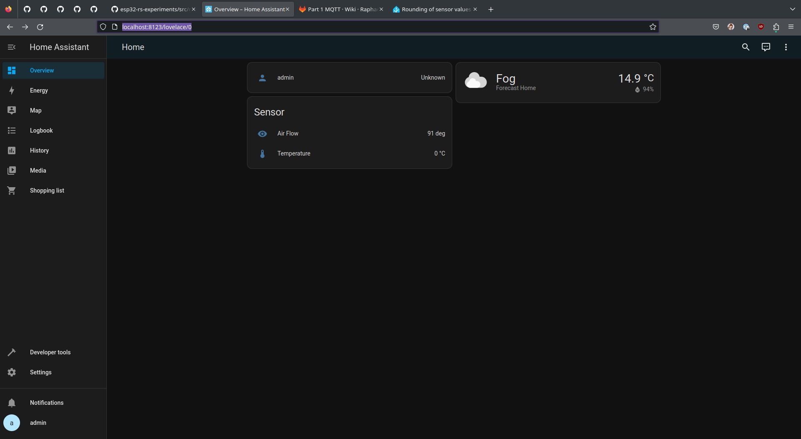
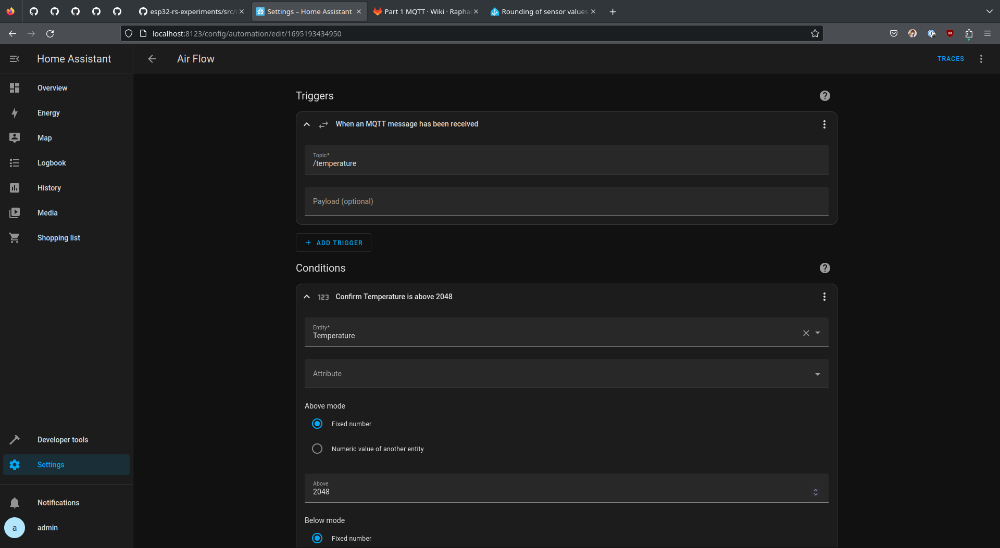
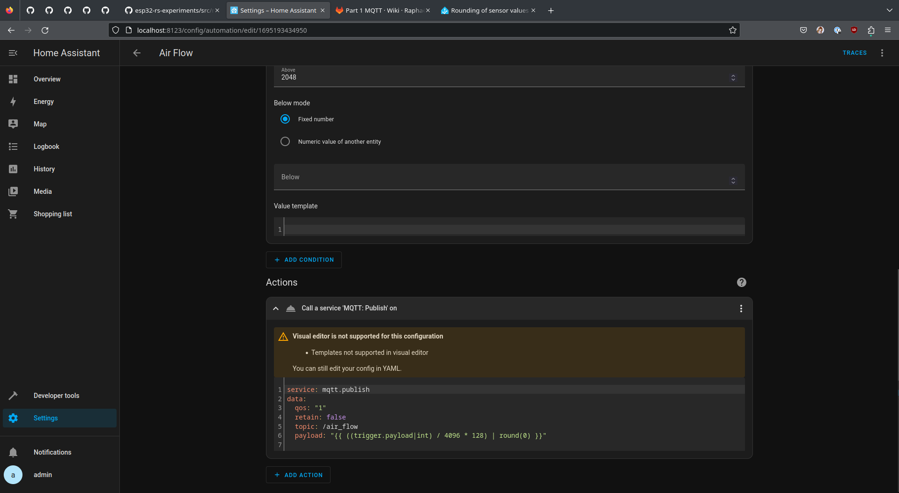

# Part1

## Librairies ESP

- Servo: madhephaestus/ESP32Servo
- MQTT: 256dpi/MQTT
- Queue: einararnason/ArduinoQueue

## Description du Projet

Le projet est composé:

- Un PC (docker)
    - MQTT Broker
    - Home Assistant / Script python
        - Ecoute sur /temperature et émet l'angle sur /air_flow
- Un ESP32
    - Avec un servomoteur en sortie
    - Qui écoute /air_flow
- Un ESP32
    - Avec un potentiomètre en entrée
    - Qui émet sur /temperature 

## [Carte ESP Cervo](./ESP_Cervo/src/main.cpp)

- Lis une valeur analogique à partir d'un potentiomètre simulant un capteur de température.
- Publier la valeur analogique en tant que température (de 0 à 4096 degrés) sur le topic `/temperature`.

## [Carte ESP Temp](./ESP_Temp/src/main.cpp)

- S'abonne au topic `/air_flow`
- Contrôle le moteur servo en fonction des valeurs d'angle reçues.

## Ordinateur

- Utilise un [script Python](./Python/main.py) / [Home Assistant](./HA/automations.yaml) pour relier les deux topic MQTT (`/temperature` et `/air_flow`).
- Ajuster le débit d'air en fonction des changements de température à l'aide d'une fonction. (Si Temp > 2048 renvoie une valeur d'ouverture d'angle entre 0 et 128)

### Prérequis

- Python avec le package 'paho' installé.

## Premiers pas

Pour configurer et exécuter le projet, suivez les étapes suivantes :

1. A la racine du Git
2. Lancer les docker avec `docker compose up -d`
3. Copier les configs de Home Assistant `cp ./Part1/HA/* ./docker/home-assistant/`
4. Recharger les configs de home assistant dans l'interface
5. Build la partie ESP_Cervo et flasher la première carte avec PlatformIO
6. Build la partie ESP_Temp et flasher la première carte avec PlatformIO
7. Faire les montages électriques en suivant la vidéo
8. Profit

## Home Assistant
### Dashboard

### Automation

## Conclusion

Ce projet démontre l'intégration des cartes ESP, de la communication MQTT et d'un script Python pour réaliser la détection de température et le contrôle du débit d'air. En suivant les instructions fournies, vous pouvez configurer le projet et explorer des approches alternatives, telles que l'intégration avec Home Assistant. N'hésitez pas à personnaliser et étendre le projet pour répondre à vos besoins spécifiques.