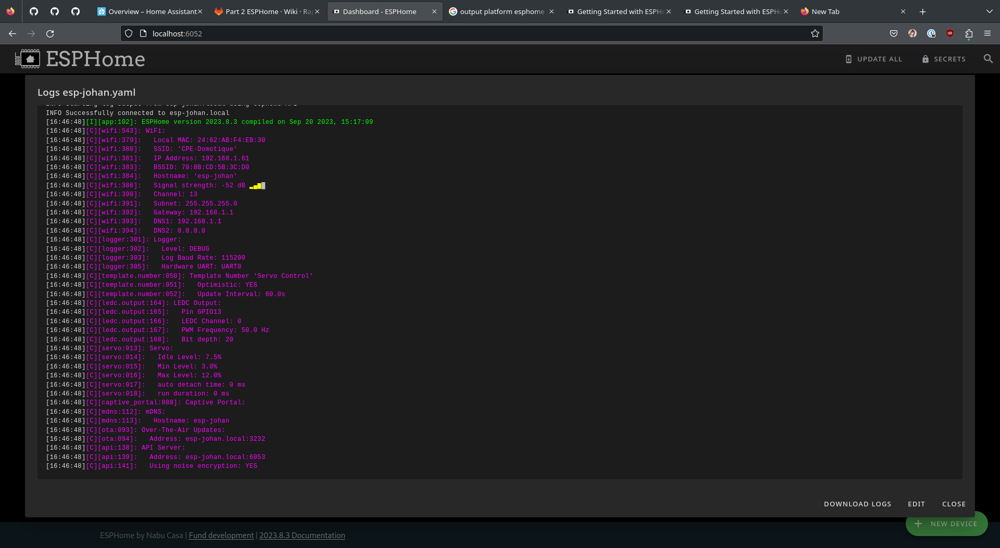
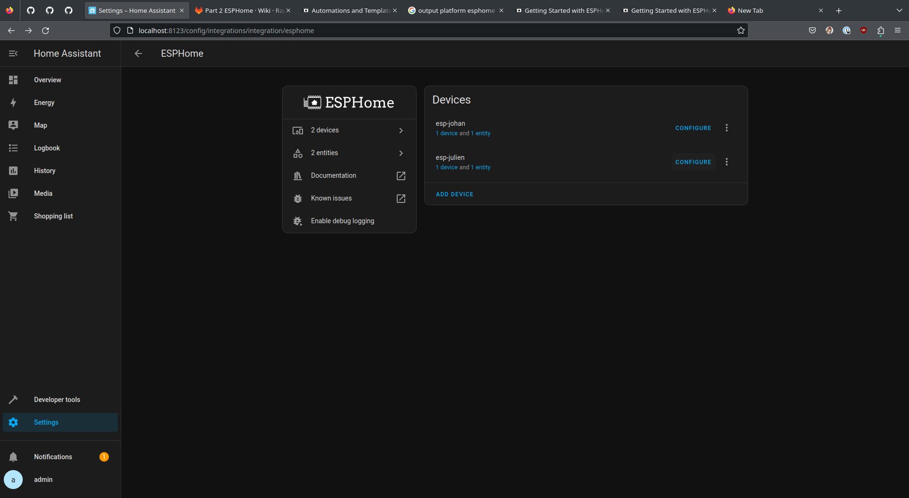

# Part2

La deuxième partie du projet implique le remplacement de MQTT par EspHome. Une liaison entre les deux EspHome sera établie via Home Assistant.

## Dashboard ESP Home

## [ESP Home potentiomètre](./ESPHome/esp-julien.yaml)

1. Installation ESP Home sur la carte
2. Liaison entre ESP Home et Home Assistant
3. Lecture de la valeur du potentiomètre
4. Flashing de la carte via ESP Home

### Logs ESP Home potentiomètre

## [ESP Home servomoteur](./ESPHome/esp-johan.yaml)

1. Installation ESP Home sur la carte
2. Liaison entre ESP Home et Home Assistant
3. Binding du servoteur
4. Flashing de la carte via ESP Home

### Logs ESP Home servomoteur

## [Home Assistant](./HA/automations.yaml)

1. Ajout des deux cartes ESP Home en device dans Home Assistant 
2. Ajout des valeurs sur le Dashboard
3. Binding entre les deux ESP via une action
4. Profit

### Dashboard

### Devices ESP Home

### ESP Home sensors / actions
