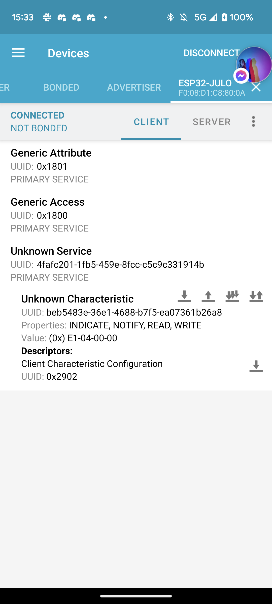
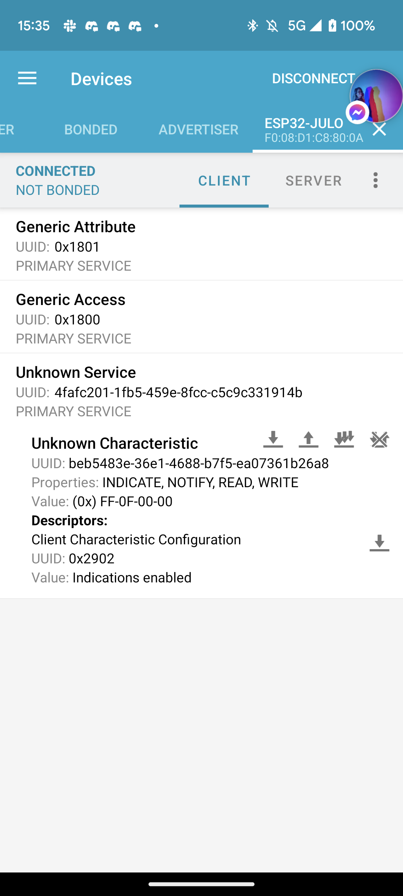

# Part3

## NRF Connect
### Température à 0

### Température à 4096

## [ESP Cervo](./ESP_Cervo/src/main.cpp)
Même code que pour la [Part1](../Part1/README.md)

## [ESP Temp](./ESP_Temp/src/main.cpp)
Même code que pour la [Part1](../Part1/README.md)

1. Suppression de la connection MQTT
2. Initialisation d'un appareil bluetooth
3. Ajout d'une caractéristique pour la température
4. Mise à jour de la caractéristique en fonction de la température

## [Script bluetooth](./Python/main.py)

1. Connection à l'ESP
2. Si la température > 2000 envoi de l'ouverture sur le topic MQTT `/air_flow` sinon envoi de 0 pour fermer l'ouverture
