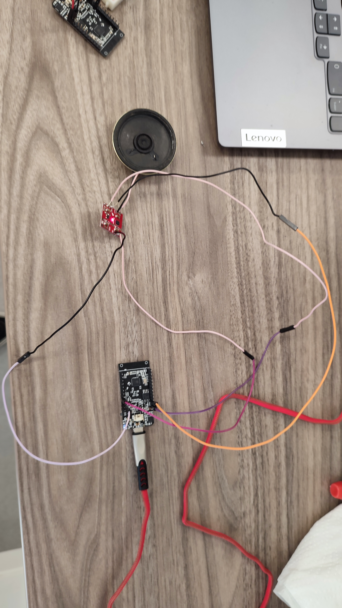
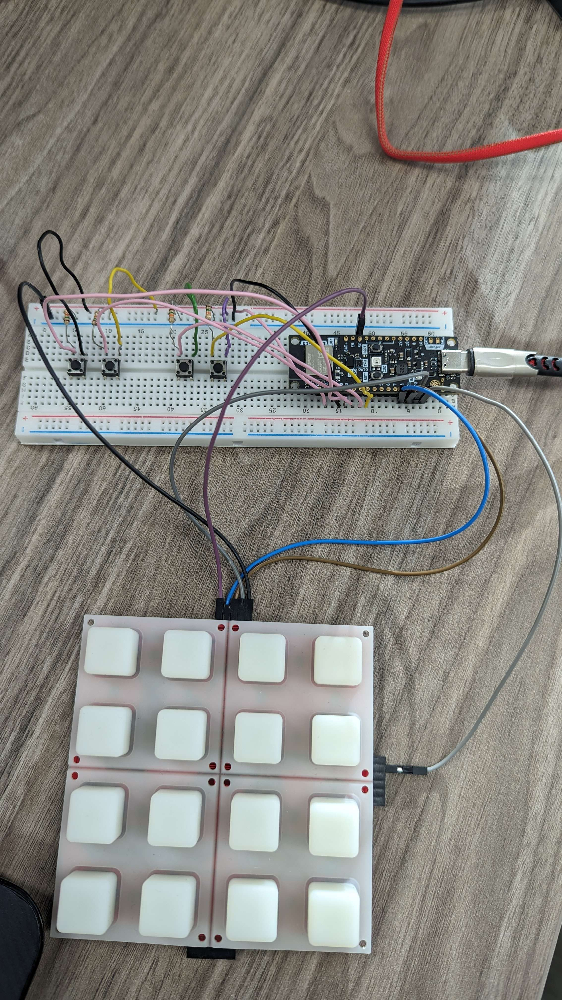
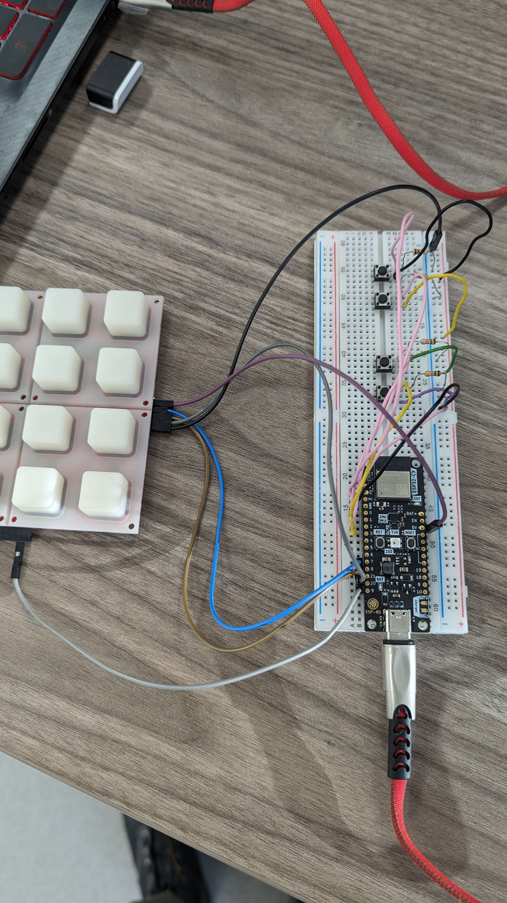
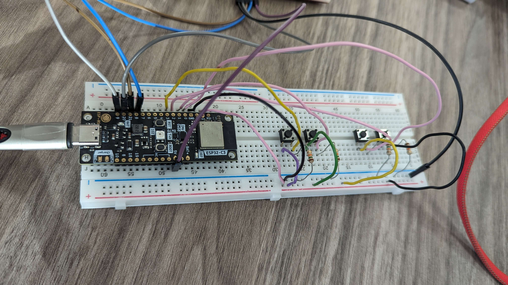

# WISPS (Wireless Sequencer Pad & Speakers)
L'objectif était de faire un Pad connecté permettant de jouer des notes à distances sur un nombres quelconque d'enceintes.

## Partie [Enceinte](./ESP-Enceinte/src/main.cpp) - Julien CAPOSIENA
Cette partie est la sortie du projet, il est possivle d'avoir un ou plusieurs circuits (pour avoir plusieurs enceintes) qui écoutent sur un channel MQTT et jouent les notes qu'ils reçoivent sur ce channel.

### Technologies
- Esp32 TTGO (avec platform.io)
- Sparkfun Mono Audio Amplifier (https://www.sparkfun.com/products/11044)
    - Documentation https://www.sparkfun.com/tutorials/392
- MQTT avec la librairie 256dpi/MQTT (https://github.com/256dpi/arduino-mqtt)

### Montage

## Partie [Traducteur de notes](./Python/main.py) - Julien CAPOSIENA
Cette partie est le cerveau du projet, elle se charge de convertir la touche appuyée en note ou en action logique (mettre en pause, passer en mode live, traduire la touche en note, sauvegarder et rejouer les notes du mode séquenceur)

### Technologies
- MQTT avec la librairie paho (https://pypi.org/project/paho-mqtt/)
- BLE avec la librairie bleak (https://github.com/hbldh/bleak)

## Partie [Pad](./esp-rs-pad/src/main.rs) - Johan PLANCHON
Cette partie est la partie utilisateur du projet, chaque touche appuyée renverra un retour visuel à l'utilisateur et mettra a jour une propriété du serveur BLE (la limite d'une touche à la fois a été conservée du button pad qui ne supporte pas plus).

### Setup (pour ubuntu)
1. Dépendances `apt install curl git build-essential python3 python3.8-venv python3-pip libclang-dev libudev-dev pkg-config`
2. Rustup & Rust (rust version manager: https://rustup.rs/) `curl --proto '=https' --tlsv1.2 -sSf https://sh.rustup.rs | sh`
3. ldproxy pour générer le payload et espflash pour  flasher la carte `cargo install ldproxy espflash`
4. Pour lancer le projet, brancher la carte en USB et `cargo run`

### Technologies
- Esp32 Rust (avec l'esp32-c3 https://github.com/esp-rs/esp-rust-board qui supporte la STD de Rust)
    - Le support de la STD et donc du projet devrait marcher sur toutes les cartes qui supportent ESP-IDF (https://esp-rs.github.io/book/overview/using-the-standard-library.html) et qui possèdent une puce bluetooth avec le support du BLE
- Implémentation du SPI Sparkfun pour le Button Board Controller en suivant la documentation (https://www.sparkfun.com/datasheets/Widgets/ButtonPadControllerSPI_UserGuide_v2.pdf) **attention, certains nommages sont inversés dans certaines partie de la documentation MOSI <-> MISO**
    - Le SPI Sparkfun est non standard sur de nombreux points, Cf. les commentaires de la fiche produit : https://www.sparkfun.com/products/retired/9022
- BLE pour se commecter au traducteur de notes en utilisant la librairie NimBLE (https://lib.rs/crates/esp32-nimble)

### Montage

